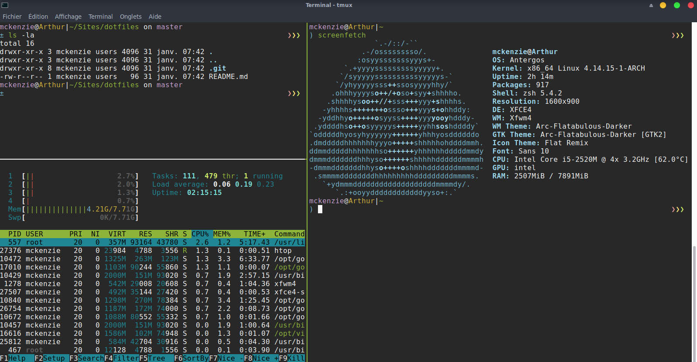
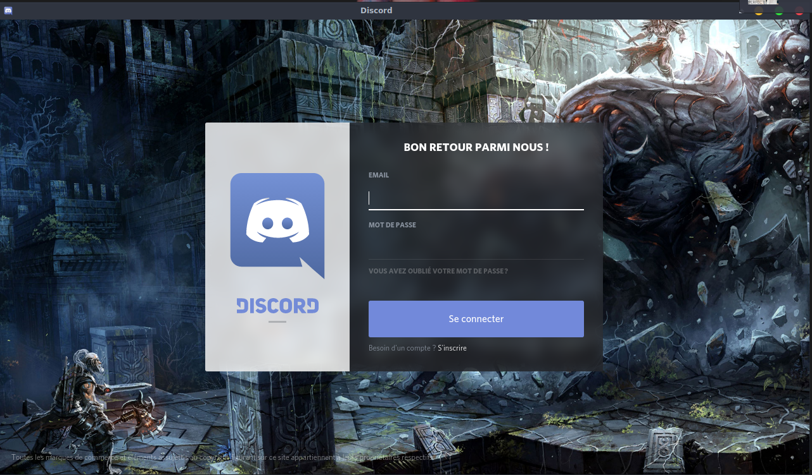

# Dotfiles

Ce dépot est une aide personnelle pour me permettre de facilement me retrouver dans mes configurations et aussi lors d'une nouvelle installation de mon système d'exploitation Linux de savoir comment configurer mon système.





## Installation

Pour commencer il faut clôner le dépôt :

```
git clone https://github.com/Mckenziearts/dotfiles.git ~/.dotfiles
```
Créez des liens symboliques pour les configurations que vous souhaitez utiliser, exemple :

```
ln -s ~/.dotfiles/vim/.vimrc ~/.vimrc
```
Ou vous pouvez juste copier le dossier conrespondant dans votre propre configuration, exemple :

```
cp -r ~/.dotfiles/vim ~/.config/vim
```

Ensuite vous pouvez éditer le fichier selon vos préférences personnelles :smiley:

La liste des paquets installés sur ma machine sont disponibles dans le fichier `package.list`, et mes paquets pour le développment se trouvent dans le fichier `development.list`.

```
cat .dotfiles/packages/package.list | xargs yaourt -S --needed --noconfirm
```

## Trucs & Astuces

### Polices de caractères

Les polices de caractères utilisées pour le système Linux sont disponibles [ici](https://github.com/powerline/fonts)

## Trouver le process qui utilise un port

```
sudo netstat -nlp | grep <port>
```

## Configuration additionnelle

Certaines configurations nécessitent une installation ou une configuration supplémentaire. Si c'est le cas, vous pouvez trouver un fichier README.md dans le répertoire de l'application. Assurez-vous de jeter un coup d'oeil.

## Quand le son se met à foirer

Installer les paquets `pulseaudio` et `pavucontrol` puis régler le volume avec la commande 

```shell
alsamixer
```

## Discord

Parce que j'ai toujours eu un problème de clé publique lors de l'installation de discord. Je met ma démarche pour eviter de traîner plus longtemps lors des prochaines installations



Il faut déjà renseigné la clé suivante dans votre système via votre terminal

```shell
gpg --keyserver pgp.mit.edu --recv-keys 11E521D646982372EB577A1F8F0871F202119294
```

Puis vous pouvez directement lancer l'installation de discord via `yaourt`

```shell
yaourt -S discord
```